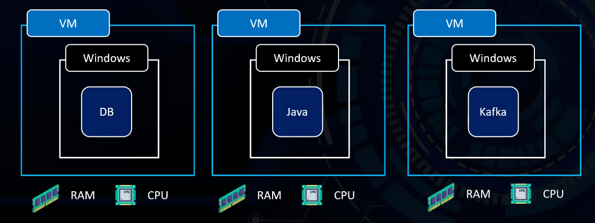
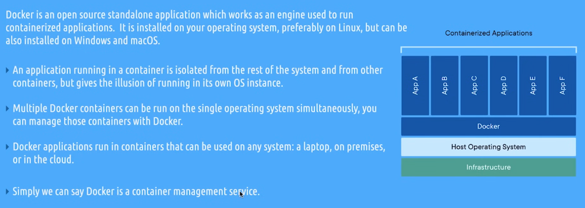
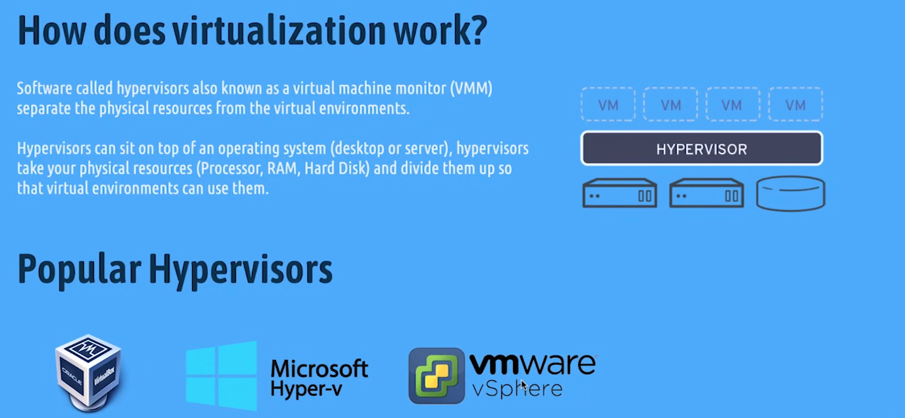
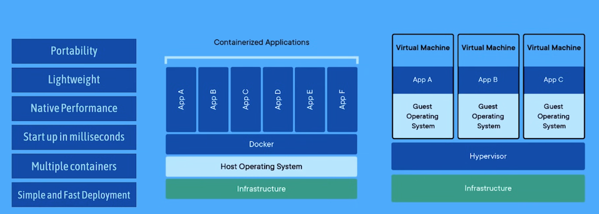

</details>

<details>
<summary><b>Why not virtual machine and why docker ?</b></summary><br>



</details>

<details>
<summary><b>What is docker and container and image</b></summary><br>



A **Docker container** is a small, isolated environment that contains an application and all its dependencies, so it can run the same way on any system.

- **Container** = running app

A container is very similar to a process, but more powerful.

`Simple explanation:`
- A process = a running program on your system
- A container = an isolated process with its own environment

A **Docker image** is a read-only template (blueprint) that contains an application along with all its dependencies, such as code, runtime, libraries, and configuration, while a Docker container is a running instance of that image, providing a small and isolated environment where the application runs consistently on any system.

</details>

<details>
<summary><b>Virtualisation and hypervior</b></summary><br>




# Virtualisation vs Containerization



</details>

<details>
<summary><b>Client - Registry - Namespace - Daemon</b></summary><br>

### Docker Client: 
the tool (command line) you use to interact with Docker, like running commands to build or start containers.

### Docker Registry: 
a storage place where Docker images are saved and shared, like Docker Hub, is a storage system (usually remote) where Docker images are saved and shared.

**Docker Registry** is **not local by default**.

* It is a **remote storage** (on the internet) 
* Used to **save and share images**

example : **Docker Hub** a public registry.

But You can also have a **local registry** on your machine if you want

### Namespaces: 
a Linux feature used by Docker to isolate containers, so each container has its own separate view of resources like processes, network, and files, making them independent from each other.


### Docker Daemon** 
(dockerd) is the **core engine of Docker**.

**What it does:**

* Builds images 🧱
* Runs containers 🚀
* Stops / deletes containers
* Manages networks and volumes

**How it works:**

You type a command (like `docker run`) in the **Docker Client** →
the request goes to the **Docker Daemon** →
the daemon executes it.

</details>

<details>
<summary><b>Docker Commands</b></summary><br>

**To see all informations about your docker**

`docker info`

**To install image**

`docker run "name of image yo want to install"`

(If the image exists on your machine, Docker uses it directly; if not, it automatically pulls it from Docker Hub)

**Create and start a container**

`docker run -d -p 80:80 nginx` this is just example for nginx p 80:80

`-d` (detach) : run the container in the background
✔️ so your terminal stays free
❌ without it → the terminal gets “blocked”


`-p` 80:80 : connect ports
first 80 = your machine
second 80 = container


**NOTE :** once the container starts, `RUN` is no longer used

Why?

Because RUN is only for building the image, not running it, that's why we used scripts in runtime to install the rest of instructions

**To see containers you running on docker**

`docker ps -all`

or 

`docker container ls`

**To see containers running and stopped**

`docker ps -a`

**To remove container**

`docker rm "id of container"`

**To see images**

`docker images`

**To remove images**

`docker image rm "name of image or ID"`

**To shows the output of the container (what the app prints)**
(ex: errors, messages, print statements)

`docker logs` (name of app)

**To shows live resource usage of containers (CPU, memory, network)**

`docker stats`

___

**To run a command inside a running container**

`docker exec`

`docker exec -it n1 bash` (this well run bash inside image of ngninx name of it is n1)

`-i` → keep input open
`-t` → gives a terminal (TTY) 

**To build docker compose**

`docker-compose up --build` : tool that reads your docker-compose.yml

`up` : start everything
`--build` : rebuild images before starting
means:
- read Dockerfiles again
- build fresh images
- then start containers

It understands:
- services (nginx, wordpress, mariadb)
- networks
- volumes
- build paths

**This is the full idea**

`[docker-compose reads file → builds images → creates containers → connects everything → runs system]`

**Run container without dependencies in dockerfile**

`sudo docker compose up --no-deps nginx`

**To Stops and removes containers and Volumes:

`docker compose down -v`

`down` : shuts everything down 
`-v` : Removes volumes

It does NOT remove images by default — the Docker images themselves remain cached locally.

___

**Difference between CMD and ENTRYPOINT**

cmd to run commands, and entrypoint to run scripts

___

**If you debbuging something and you need to see if container running you can run this**

`docker inspect my_container`

and look for this

```c
"State": {
  "Running": true
}
```

___

`docker compose up -d`

* **Purpose:** Start containers in detached (background) mode.
* **Behavior:**

  1. Checks if the container exists:

     * If yes → starts it.
     * If no → creates and starts it.
  2. Uses **existing images** unless `build:` says otherwise and the image doesn’t exist.
* **Does not rebuild images** automatically.
* **Good for:** Just starting your app when images are already built/pulled.

This command Fast because:

- It does not rebuild images.
- It does not reinstall anything inside the container; it just starts containers from existing images.

Think of it as “turning on a machine that’s already built.”

If the image already exists (pulled or built previously), it just creates and starts the container. That’s why it’s almost instant.
Result: You get running containers quickly, but any changes in Dockerfile or dependencies are ignored.


**Key difference in simple terms between it and the prev cmd**

| Command                     | Rebuild images? | Run containers in background?   |
| --------------------------- | --------------- | ------------------------------- |
| `docker compose up -d`      | ❌ No            | ✅ Yes                           |
| `docker compose up --build` | ✅ Yes           | ❌ By default, unless `-d` added |

Think of it like:

* `up -d` → “Start my app quickly using what’s already built.”
* `up --build` → “Make sure my images are up-to-date, then start my app.”

**Important note for WordPress + MariaDB**:

* If your `.env` changes (like DB credentials) but volumes already exist, **rebuilding the image won’t change the database**.
* To reapply `.env` to MariaDB, you need to **remove the old volume** (`docker compose down -v`) before starting.


___

**To see exactly where is the problem of container**

`docker compose logs adminer`

**example :** adminer  | 2026/04/22 20:05:43 [emerg] 1#1: host not found in upstream "wordpress" in /etc/nginx/sites-enabled/adminer:22

</details>

<details>
<summary><b>How to build your Own Docker-Compose</b></summary><br>

Docker Compose is a tool that lets you define and run multi-container applications using a single configuration file.

Instead of manually starting containers one by one with Docker commands, you describe everything in a YAML file (usually called docker-compose.yml) and then bring it all up together with one command.

## services:

This is where you define your containers (apps), Each one = 1 container:

- nginx
- wordpress
- mariadb

## build:

It tells Docker Compose “don’t use a pre-made image, build it yourself from a Dockerfile.

When we pass a path that means ,Go to the folder and Find a Dockerfile and Build an image from it, Then run a container from that image

- If you use Docker Hub image you chose image directly from Docker Hub without build.

## container_name:

this only helps for fixing names for containes, If you removed Docker gives random name like srcs-nginx-1, (Not required but useful).

## depends_on:

start order only , example: nginx waits wordpress to start, does NOT wait for the container to be ready , It only waits for container to start (process is running)

- if you removed containers may start in wrong order → errors at startup
- It does NOT “go back and wait until ready", It only checks: is container running? yes/no

## volumes:

A volume is storage that lives outside the container. It lets data persist even if the container is deleted

Why we use it:
- WordPress files stay even if container is deleted
- MariaDB keeps database safe

If removed: everything resets every restart

**Example :**

```c
    volumes:
      - wordpress_data:/var/www/html
```
now we talk to the second line

It has 2 parts:
wordpress_data (LEFT side)

This is the volume name, like “storage box name”

- It’s just a label to Creat and manage by Docker and Stores data permanently
- Can be reused by other containers

/var/www/html (RIGHT side)

- This is the path inside the container
- This is where the app stores files (WordPress files, uploads, themes)

## networks:

- all containers can talk to each other, (inside container CONNECTS container to that network)
- We write network twice (in bottom part) to CREATES the network.

Example:
```
nginx → wordpress
wordpress → mariadb
```

- If you removed:  containers cannot connect → project breaks.

- If you remove bottom part Docker will: either auto-create it , OR give error (depending config)


`- inception` vs `inception:`

**🔹 Inside service:**

```yaml
networks:
  - inception
```

This is a **list (array)**
Means:

* this container connects to **one or more networks**

Example:

```yaml
networks:
  - inception
  - another_network
```
**🔹 Bottom:**

```yaml
networks:
  inception:
```

This is a **definition (object/dictionary)**
Means:

* create a network named `inception`

You can also configure it:

```yaml
networks:
  inception:
    driver: bridge (if you use it inside this project the containers still works)
```
- bridge → internal communication (containers)
- ports → external access (browser)


**If you mix them wrong:**

❌ this is WRONG:

```yaml
networks:
  inception
```

## env_file:

We use it to loads variables from file

- we can also write variables in docker-compose directly

but inside the file :

- ✔ clean
- ✔ secure (passwords not in compose)
- ✔ used in 42 subject

</details>

<details>
<summary><b>How to write Dockerfile</b></summary><br>

Dockerfile It’s just a set of instructions to build an image.

Choose a base image (FROM)

You always start with **FROM**

Before your app runs, it needs:

- system (Linux)
- tools (Node, Python, gcc…)
- libraries (dependencies)
- your code


<details>
<summary><b>Some infos</b></summary><br>

**Every image already has a minimal OS (like Ubuntu, Alpine) , What means that ???:**

Example 

`FROM node:18`

You are NOT starting from nothing.

Inside node:18 there is already:

- a Linux OS (usually Debian)
- Node.js installed
- basic system tools

**What is a “minimal OS”?**

It’s just a very small Linux system without extra stuff.

Examples:

Ubuntu (big)
- full OS, many tools ,heavier

Alpine (small)
- super lightweight, only essentials ,faster

**How capacity works**

Docker uses something called:  **layers**

Example :
```
FROM debian:bookworm
RUN apt update
RUN apt install -y curl
```

Each step creates a layer:

- Layer 1 → Debian OS
- Layer 2 → apt update
- Layer 3 → curl installed

if you don't manage the layers with minimalizing method , that can give you this problems

- bigger image size
- more layers to manage
- slower image pull (download)
- less efficient caching

</details>

## Dockerfile of nginx

`RUN apt-get update && apt-get install -y nginx openssl`

You are NOT “combining them together”, You are just installing 2 packages in one command

Why we call nginx openssl and not only openssl directly ??

OpenSSL + NGINX

**OpenSSL**
    → generates SSL certificate (key + crt)
    OpenSSL is just setup tool

**NGINX**
    → is the server that:

listens on port 443 , uses the certificate for HTTPS

- OpenSSL → creates certificate files
- NGINX → uses those files
- Browser → connects to NGINX on 443 (HTTPS)

<details>
<summary><b>Certificate</b></summary><br>

What we do inside here to enables HTTPS (port 443)

`openssl req -x509 -nodes -days 365 \`

* **openssl** → tool for security (SSL certificates)
* **req** → create a certificate request
* **-x509** → make a self-signed certificate (not from a CA)
* **-nodes** → no password on the private key
* **-days 365** → certificate valid for 365 days

* **CA (Certificate Authority)**
  → A trusted company that gives certificates
  (like a “digital police” that says: this site is legit)
  Examples: Let’s Encrypt, DigiCert

* **req (request)**
  → Short for **certificate request (CSR)**
  → It’s like a form you create and send to a CA to ask for a certificate

* **no password on the private key (-nodes)**
  → Normally, your private key is protected with a password
  → With **-nodes**, it removes that protection


```c
-newkey rsa:2048 \
-keyout /etc/nginx/ssl/nginx.key \
-out /etc/nginx/ssl/nginx.crt \
-subj "/C=MA/ST=Casa/L=Casa/O=1337/OU=student/CN=localhost"
```


* **`-newkey rsa:2048`**
  → creates a **new private key + certificate** using RSA encryption (2048-bit = secure level)

* **`-keyout /etc/nginx/ssl/nginx.key`**
  → where to save the **private key file**

* **`-out /etc/nginx/ssl/nginx.crt`**
  → where to save the **certificate file**

* **`-subj "/C=MA/ST=Casa/L=Casa/O=1337/OU=student/CN=localhost"`**
  → info inside the certificate:

  * **C** = country (Morocco)
  * **ST** = state (Casablanca)
  * **L** = city
  * **O** = organization (1337)
  * **OU** = department (student)
  * **CN** = domain name (localhost → your local server)

</details>
<br>

**EXPOSE : 443**

```c
# EXPOSE does NOT publish or open any port.
# It is only metadata that documents which port the container listens on.
# Removing it does NOT affect the container or networking.
# Actual port mapping is handled by docker-compose (ports section).
EXPOSE 443
```
**`CMD ["nginx", "-g", "daemon off;"]`**

Start nginx in frontend required for Docker (otherwise container stops)

`-g`: allows you to pass a configuration rule to nginx at startup., (the rule  here is daemon off)

`daemon off:`  means “don’t run in background


## Dockerfile of maridb

`mariadb-server` : server here means,  program that runs in background and listens for requests

Example:

```js
WordPress → asks → database server → returns data
```

`chown -R mysql:mysql /run/mysqld`

* `chown` → change owner of files/folders
* `-R` → recursive (apply to all files inside folder)
* `mysql:mysql` →

  * first `mysql` = user
  * second `mysql` = group
* `/run/mysqld` → folder used by MariaDB at runtime

`/run/mysqld`

* `/run` → Linux directory for temporary runtime files (cleared on reboot)
* `/mysqld` → folder used by MariaDB

It is a runtime directory used by MariaDB while running.

It stores:

* **PID file** → identifies the running MariaDB process
* **socket file (`mysql.sock`)** → used for internal communication between applications and MariaDB


</details>


<details>
<summary><b>Config File of Nginx</b></summary><br>

## server {}

This defines a virtual server

Meaning:

- one website config
- handles requests for a domain

## listen 443 ssl;

NGINX opens socket on:
- port 443
- expects HTTPS (SSL)

Internally:
- OS gives nginx port 443
- nginx waits for connections

## server_name localhost;

When request comes:

Browser sends:

`Host: localhost`

NGINX:

- matches it with server_name

## SSL lines

```c
ssl_certificate ...
ssl_certificate_key ...
```
Internally:

- TLS handshake happens

nginx uses:

- private key
- certificate

**What is TLS Handshake?**

🔐 First: TLS = HTTPS security
🔥 Handshake = first contact

When browser connects:

```c
Browser → NGINX: "I want secure connection"
NGINX → Browser: "Here is my certificate"
Browser → NGINX: "OK, I trust you"
```

After that:
connection becomes encrypted 🔒

Without this  ---> encrypted connection cannot start

## root /var/www/html
### index index.php index.html;

1) `root /var/www/html` 

**What means root :**

- `root` is an Nginx directive that defines the base directory of the website.
- It is not related to Linux privileges.
- Nginx uses it to map a URL request to a file path by appending the request URI to that directory.
- There is also `alias`, which maps paths differently (it replaces instead of appending).

The path : This tells Nginx -->  “All files I serve are located in this folder inside the container”

**Example**

User opens:

```
https://localhost/about.html
```

Nginx will look for:

```text
/var/www/html/about.html
```
Why `/var/www/html` specifically?

It’s just a **convention**, not magic

* Most web servers use it by default
* Official images (nginx, wordpress, php) expect this path

✔ You **can change it**, but:

* then you must make sure files exist there

2) `index index.php index.html;`

this files It comes from Nginx default config (by default )

When user accesses a folder like:

```
https://localhost/
```

Nginx will look for:

```text
1. index.php
2. index.html
```

first one found is used

**Example**

Request:

```
https://localhost/
```

Nginx tries:

```text
/var/www/html/index.php   ✔ (exists → used)
/var/www/html/index.html  (ignored)
```

##  location / ...

```js
    location / 
    {
        try_files $uri $uri/ /index.php?$args;
    }
```

1) location is a rule that matches a URL It tells Nginx:

> “If the request URL matches this pattern → apply these instructions”

`/` means:

match everything that starts with `/`

2) What is `try_files`?

> “Try these options in order, and use the first one that exists”

**Example :**

When a request comes:

```text
GET /something
```

Nginx will test:

**1️⃣ `$uri`**

exact file

Ex:

```text
/something → /var/www/html/something
```

✔ If file exists → serve it directly

**2️⃣ `$uri/`**

check if it’s a folder

Ex:

```text
/something → /var/www/html/something/
```

✔ If folder exists → serve it (maybe index inside)

**3️⃣ `/index.php?$args`**

we call it fallback, refers to a backup strategy or alternative route that takes effect when a primary method, system, or plan fails, It acts as a final safety net to maintain continuity and prevent total system failure or service

If nothing found:
➡ send request to:

```text
/index.php
```

with query parameters (`$args`)

**What is `$args`?**

query string from URL

Ex:

```text
?page=home&user=rida
```

So:

```text
/index.php?page=home&user=rida
```


##  location ~ \.php$....
```js 
    location ~ \.php$ {
        include fastcgi.conf;
        fastcgi_pass wordpress:9000;
        fastcgi_param SCRIPT_FILENAME $document_root$fastcgi_script_name;
    }
```

1) `location ~ \.php$`

Means Match all requests that end with .php

- `~` → regex (pattern matching)
- `\.php` → .php (escaped dot)
- `$` → end of string

✔ Matches:

```js
/index.php
/test.php
/blog/index.php
```

❌ Does NOT match:
```js
/index.php/test
/file.html
```
2) `include fastcgi.conf;`

fastcgi.conf already exists inside Nginx after installing, You did NOT create it manually.

This loads a predefined config file

What’s inside it?

Important things like:

```js
fastcgi_param QUERY_STRING $query_string;
fastcgi_param REQUEST_METHOD $request_method;
fastcgi_param CONTENT_TYPE $content_type;
```

These are variables sent to PHP

Why needed?? --> Because: "PHP needs request info (GET, POST, headers, etc.)"

3) `fastcgi_pass wordpress:9000;`

this line means Send this request to PHP-FPM server

- `wordpress` → Docker service name
- `9000` → port where PHP-FPM listens

In Docker:
```js
services:
  wordpress:
```
Docker creates internal DNS:

`wordpress → container IP`

So Nginx does:

`send PHP request → wordpress container → port 9000`

4) `fastcgi_param SCRIPT_FILENAME $document_root$fastcgi_script_name;`

tells PHP which file to execute

- `$document_root` = value of `root /var/www/html;` -> /document_root = /var/www/html
- `$fastcgi_script_name` = requested file

Example -> `/index.php`

Combined:

```js
/var/www/html + /index.php
= /var/www/html/index.php 
```
This is sent to PHP:

> “execute THIS file”


</details>

<details>
<summary><b>Script of wordpress</b></summary><br>

`until mysql -h mariadb -u "$MYSQL_USER" -p"$MYSQL_PASSWORD" -e "SELECT VERSION();" > /dev/null 2>&1; do`

`until ... do`
-  repeat until command works

while NOT condition → keep looping

if everything okey (condition become true), we done

`"SELECT VERSION();"` : this show the version of DB if it's work so the DB installed correctly

_______

`wp core download`

This means:

“Download the WordPress core files”

What it actually does:

It downloads:

WordPress PHP files
folders like:

```c
wp-admin/
wp-includes/
wp-content/
```
basically: full WordPress system
_______

`--allow-root`

WordPress blocks root user by default

**BUT in Docker:**

- everything runs as root inside container, So we must allow it.

_______

we creates file with : `wp config create` using values we passed

name of file : `wp-config.php`


**How?**

It generates a PHP config file like:

```c
define('DB_NAME', ...);
define('DB_USER', ...);
define('DB_PASSWORD', ...);
```

we need --dbhost=mariadb:3306 , to tells WordPress:

```c
DB host = mariadb container
port = 3306
```

_______

`wp core install`

> means : “Initialize WordPress inside the database and create the admin site”

**Step-by-step what happens**

#### 1- Connects to database

It reads `wp-config.php`:

* DB name
* user
* password
* host

connects to MariaDB

---

#### 2- Creates database structure

It creates tables like:

* `wp_users`
* `wp_posts`
* `wp_options`
* `wp_comments`

now WordPress has storage

---

#### 3- three: Sets your website URL

```bash id="u2k8m1"
--url="$DOMAIN_NAME"
```

This defines:

* your site address

Example:

```text id="x9d3p7"
https://localhost
http://mywebsite.com
```

WordPress uses it for:

* links
* redirects
* admin panel URL

---

#### 4- Sets website title

```bash id="v4n6q8"
--title="inception"
```

This is your site name:

* shown in browser tab
* WordPress dashboard title

---

#### 5- Creates admin user

```bash id="c7r2t5"
--admin_user="$WP_ADMIN"
```

creates the main login account

Example:

```text id="m8k1z3"
username: admin
```

---

#### 6- Sets admin password

```bash id="p0x9h4"
--admin_password="$WP_ADMIN_PASSWORD"
```

password for admin login

---

#### 7- Sets admin email

```bash id="n3s7w2"
--admin_email="$WP_ADMIN_EMAIL"
```

used for:

* recovery
* notifications
* WordPress alerts

---

#### 8- `--allow-root`

allows running as root inside container

Without it:
:x: WP-CLI refuses to run

_______

`mkdir -p /run/php`

This folder is used by PHP-FPM to store its socket file.

* Folder for **PHP-FPM socket file**
* Example: `/run/php/php8.2-fpm.sock`

Used for communication between **Nginx** and PHP

**Why create it?**

* `/run` is temporary (may not exist in Docker)
* If missing ❌ → PHP-FPM won’t start

_______

`exec php-fpm8.2 -F`

`exec` replaces the current process with another process

Instead of:

`bash (shell) → runs php-fpm`

exec does:

`bash is replaced by php-fpm`

`-F` : run in foreground

**What is the “main process”?**

In a container:

```c
PID 1 = main process
If PID 1 stops → container stops
```

**without exec?**

If you do directly:

php-fpm8.2 -F

```c
shell stays as PID 1
php-fpm becomes a child process
```


**NOTE :**  Order of installing wp matters

- WordPress CLI commands depend on previous steps being completed.

Think of it like a chain:

```c
download → config → install
Each step prepares something needed for the next.
```

(**if you remove it , the containers works but setuping of the website doesn't finish of setuping the wordpress**)

</details>


<details>
<summary><b>.env file</b></summary><br>

### `.env` + `$VARIABLE`

* `.env` is a file that stores key-value pairs (e.g. `MYSQL_USER=admin`).
* Docker Compose reads `.env` using `env_file` and injects them into containers as **environment variables**.
* Inside containers, variables are accessed using `$VARIABLE` (e.g. `$MYSQL_USER`).
* The script does NOT read `.env` directly — it reads values from the container environment.
* Flow: `.env → docker-compose → environment variables → `$VARIABLE` in scripts`.

`$VAR` means “replace with the value stored in environment”.


### 1. How variables are set in the OS (Linux)

In Linux, environment variables are stored inside a process using something like:

```c id="a1"
key=value
```

Example:

```bash id="a2"
export MYSQL_USER=admin
```

This tells the OS:

* “attach this variable to the current process”


#### 2. What Docker does AFTER docker-compose

When you run:

```bash id="a5"
docker compose up
```

___

#### Step 1: Compose reads config

* reads `docker-compose.yml`
* reads `.env`


#### Step 2: Docker Engine creates container

Docker creates a **Linux process (container)** using:

* namespaces (isolation)
* cgroups (resources)


#### Step 3: Docker sets environment (IMPORTANT PART)

Before starting your script, Docker calls something like:

```c id="a6"
setenv("MYSQL_USER", "admin");
setenv("MYSQL_PASSWORD", "1234");
```

This is OS-level injection


#### Step 4: container process starts

Now Docker starts your entry process:

```bash id="a7"
bash script.sh
```

#### Step 5: Bash reads environment

Inside bash:

```bash id="a8"
echo $MYSQL_USER
```

OS replaces it from process memory


#### FULL FLOW

```text id="flow"
.env file
   ↓
docker compose reads it
   ↓
Docker Engine creates Linux container (process)
   ↓
Docker sets environment variables in process memory
   ↓
bash starts inside container
   ↓
$VAR is resolved from OS environment table
```


</details>


<details>
<summary><b>Bonus</b></summary><br>


<details>
<summary><b>Redis</b></summary><br>

### Redis

* **Redis** = in-memory database (stores data in RAM → very fast)


### Storage

* Data is stored **in RAM (instant)**
* Saving to disk is **NOT automatic**, it depends on config


### Persistence modes

1. **RAM only**

   * No disk save
   * Data lost if server stops ❌

2. **RDB (Snapshot)**

   * Saves data **periodically**
   * Possible small data loss

3. **AOF (Append Only File)**

   * Saves every operation
   * Safer (almost no data loss)


## Dockerfile

`CMD ["redis-server", "--bind", "0.0.0.0", "--protected-mode", "no"]`

`redis-server` : starts Redis (main process)
`--bind 0.0.0.0` : allows connections from other containers (WordPress)
`--protected-mode no` :

- Redis by default allows **only localhost connections** (protected mode ON).
> localhost (127.0.0.1) ✔️ 

> blocks everything else ❌
- In Docker, WordPress connects from another container → not localhost.
-  `--protected-mode no` disables this restriction so other containers can connect.

Used because Redis is **internal (not exposed to internet)**, To prevent hackers from accessing Redis from outside (that's why we set no)

- disables this protection

- allows connections from:  **other containers (WordPress)**


</details>

</details>


<details>
<summary><b>Difference between mariadb-client and php-redis</b></summary><br>

### What is mariadb-client really?

It is just a **command-line tool**

Used for:

* testing DB manually
* running SQL inside containers
* scripts (like your entrypoint)

Example:

```bash id="sql1"
mysql -u user -p -h mariadb
```

That’s it.

---

## What about php-redis?

```text id="flow2"
WordPress (PHP)
   ↓
php-redis extension
   ↓
Redis server
```

- php-redis is NOT a server
- it is a **bridge inside PHP**

---

## FULL comparison

## 🟡 MariaDB flow

```text id="dbflow"
Browser → PHP → MariaDB server
```

* PHP uses mysqli
* mariadb-client is only for terminal usage

---

## 🟢 Redis flow

```text id="redisflow"
Browser → PHP → php-redis → Redis server
```
(php-redis invisible bridge inside PHP), we don't interact with it

* php-redis = PHP extension
* Redis = cache system (not main database)

</details>

<details>
<summary><b>Aminer</b></summary><br>

**We set inside the adminer the creadintals of .env file**

the server name we means :

- Server = machine running the database

in out project :

- MariaDB container = database server


---

**How we can reach the webserver we run by php inside container of adminer**

In Adminer container:

```bash
php -S 0.0.0.0:8080
```

This means:

```text
“Start a web server listening on port 8080 inside the container”
```


**How NGINX connects to it**

In your NGINX config:

```nginx
proxy_pass http://adminer:8080/;
```

**What happens here**

1. NGINX sees request `/adminer`
2. It sends it to:

```text
adminer:8080
```

- “adminer” = container name
- “8080” = port where PHP server is listening

**Why this works**

Docker network gives:

```text
adminer → IP address of Adminer container
```

So internally:

```text
NGINX → (Docker network) → adminer:8080
```

---

```text
Browser (HTTPS 443)
   ↓
NGINX
   ↓ proxy_pass
Adminer container (php -S :8080)
   ↓
index.php (Adminer)
```


___

## Dockerfile

`CMD ["php", "-S", "0.0.0.0:8080"]` starts a **built-in PHP web server** inside the container.

* `php` → run PHP
* `-S` → start simple development web server
* `0.0.0.0` → listen on all network interfaces (so Docker/NGINX can access it)
* `8080` → port where Adminer is served


**php -S** Yes it *is* a “server”, but not the same type as NGINX.


**What it is**

```text id="t1"
php -S = built-in PHP development server
```

- So yes, it’s a server
- but **very lightweight and limited**

---

**Difference vs NGINX**

| Feature          | NGINX                 | PHP -S             |
| ---------------- | --------------------- | ------------------ |
| Type             | Production web server | Development server |
| Speed            | High                  | Basic              |
| Routing          | Yes (advanced)        | No real routing    |
| HTTPS            | Yes                   | No                 |
| Use in Inception | Main entrypoint       | Internal tool      |


## config file of nginx-- what i added

`location /adminer/`
- If URL starts with /adminer/, handle it here

`proxy_pass http://adminer:8080/;`

Send request to Adminer container using Docker DNS name adminer

- ✔ adminer = container name
- ✔ 8080 = internal port

`proxy_set_header Host $host;`

Keep original domain

- tells the adminer the request came from rmaanane.42.fr”

Important for correct URL generation

`proxy_set_header X-Real-IP $remote_addr;`

- gives Adminer the real user IP


**Simplify it with example:**

You open:

```text
https://rmaanane.42.fr/adminer
```

Request goes like this:

```text
YOU → NGINX → Adminer
```

---

**Problem**

Adminer does NOT see you directly.

It only sees:

```text
request coming from NGINX
```

**So what we do?**

We tell NGINX:

> “when you send request to Adminer, also send info about the real user”


**the line we added with variables:**

```nginx
proxy_set_header Host $host;
```

means:

```text
Send the domain (rmaanane.42.fr) to Adminer
```

---

```nginx
proxy_set_header X-Real-IP $remote_addr;
```

means:

```text
Send user's IP to Adminer
```

**Where `$host` and `$remote_addr` come from?**

- NGINX gets them from your request automatically (You don’t create them).


</details>

<details>
<summary><b></b></summary><br>


</details>